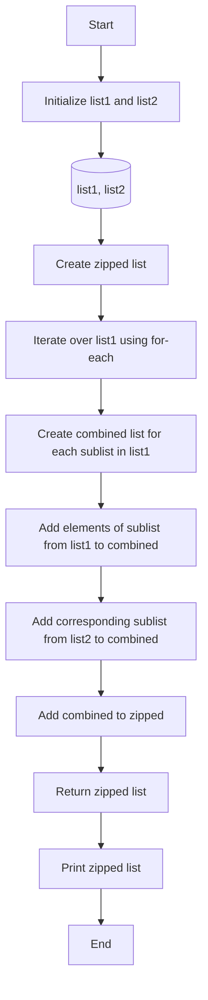

```mermaid
graph TD
    A[Start] --> B[Initialize list1 and list2]
    B --> C[(list1, list2)]
    C --> D[Create zipped list]
    D --> E[Iterate over list1 using for-each]
    E --> F[Create combined list for each sublist in list1]
    F --> G[Add elements of sublist from list1 to combined]
    G --> H[Add corresponding sublist from list2 to combined]
    H --> I[Add combined to zipped]
    I --> J[Return zipped list]
    J --> K[Print zipped list]
    K --> L[End]

```
