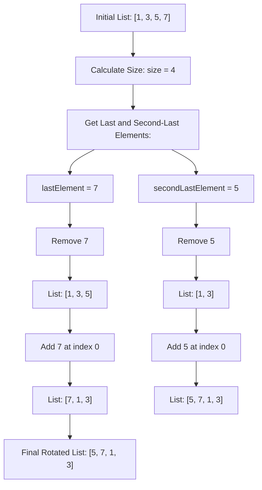

```mermaid
graph TD;
    A["Initial List: [1, 3, 5, 7]"] --> B["Calculate Size: size = 4"];
    B --> C["Get Last and Second-Last Elements:"];
    C --> D["lastElement = 7"];
    C --> E["secondLastElement = 5"];
    D --> F["Remove 7"];
    E --> G["Remove 5"];
    F --> H["List: [1, 3, 5]"];
    G --> I["List: [1, 3]"];
    H --> J["Add 7 at index 0"];
    I --> K["Add 5 at index 0"];
    J --> L["List: [7, 1, 3]"];
    K --> M["List: [5, 7, 1, 3]"];
    L --> N["Final Rotated List: [5, 7, 1, 3]"];
```
